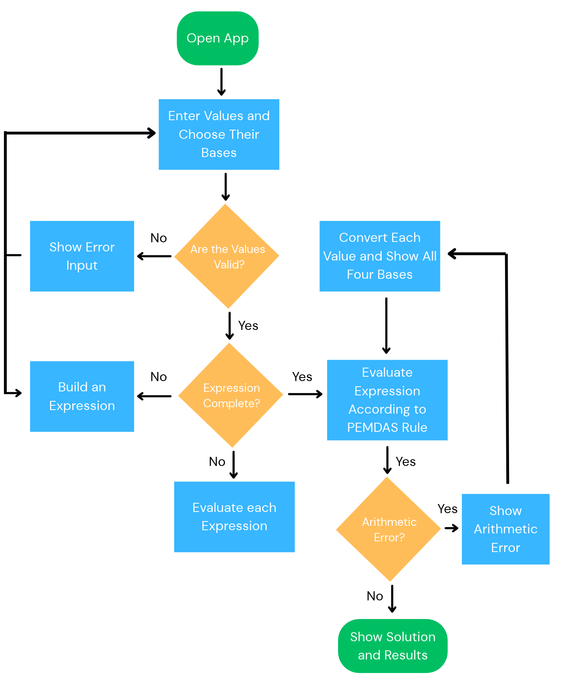

# Number System Converter & Calculator

A self-contained browser application for converting values between binary, octal, decimal, and hexadecimal, evaluating mixed-base arithmetic expressions, and learning radix-complement subtraction through interactive step-by-step views.

The application is implemented in [app.html](app.html). It requires no server, package installation, database, or internet connection.

## Features

- Convert values between binary, octal, decimal, and hexadecimal in real time.
- Accept integer and fractional values, including negative values, in all four supported bases.
- Preserve exact values with `BigInt` rational arithmetic instead of floating-point arithmetic.
- Display all four converted representations for every input.
- Copy generated results by clicking result tiles; click again to collapse expanded values.
- Build expressions with input-variable, operator, parenthesis, Backspace, and Clear buttons.
- Evaluate addition, subtraction, multiplication, division, unary signs, and parentheses with standard precedence.
- Support mixed-base expressions while preserving each input's original base.
- Show positional conversion breakdowns and final arithmetic calculations.
- Calculate radix-specific complements for every active non-negative fixed-point input:
  - Binary: 1's and 2's complements
  - Octal: 7's and 8's complements
  - Decimal: 9's and 10's complements
  - Hexadecimal: 15's and 16's complements
- Provide radix tabs for viewing complement cards in one selected base at a time.
- Provide Minuend `X` and Subtrahend `Y` selectors for complement subtraction.
- Show diminished-radix and radix subtraction methods, including carry handling, negative re-complementing, and radix-point alignment.
- Add and remove input rows while keeping at least three rows available.
- Clear all input values with one control.
- Switch between light and dark themes.
- Adapt the interface for desktop and mobile screens.

## System Requirements

Any computer, tablet, or phone with a current browser supporting JavaScript ES2020, `BigInt`, DOM events, and the Clipboard API. Current versions of Chrome, Edge, Firefox, and Safari are suitable.

Open `app.html` directly in a browser. No build command or development server is required.

## Supported Number Systems

| Number system | Radix | Accepted digits | Complement pair |
|---|---:|---|---|
| Binary | 2 | `0-1` | 1's / 2's |
| Octal | 8 | `0-7` | 7's / 8's |
| Decimal | 10 | `0-9` | 9's / 10's |
| Hexadecimal | 16 | `0-9`, `A-F`, or `a-f` | 15's / 16's |

Converter inputs may contain an optional leading minus sign and one radix point. Examples include `10.5`, `1010.1`, `2A.8`, `10.`, and `.5`. Leading and trailing spaces are removed before validation.

Complement calculations accept non-negative integer and fractional values. They use the first five fractional digits; repeating values are truncated at the fifth digit instead of being rejected. This five-digit rule applies only to the complement module; the converter and expression calculator retain their exact rational values. Negative values remain supported by the converter and expression calculator but are rejected by the complement module because complement subtraction is defined here for non-negative fixed-point operands.

## User Interface

The page contains five main areas:

1. **Header**: title, student/course information, and theme toggle.
2. **Input rows**: three rows initially, each with a source-base selector, value field, validation message, and four result tiles.
3. **Expression builder**: read-only expression display and click-built input/operator controls.
4. **Arithmetic result**: expression output, conversion solution, and results in all four bases.
5. **Complements & Subtraction**: radix tabs, per-input complement cards, and selectable X/Y subtraction.

### Input management

- `Add Input` creates another input row.
- `Remove` deletes a row only when more than three rows exist.
- Rows are renumbered after additions and removals.
- `Clear Values` empties all value fields and clears dependent output.
- Changing a base updates that row immediately.

### Result tiles

Each populated input produces Binary, Octal, Decimal, and Hexadecimal tiles. Collapsed tiles show up to five fractional digits. Clicking a tile expands it to the generated value, copies it when permitted, and briefly displays `Copied`.

## Algorithm / Pseudocode

The application converts an input in two stages: the source value is converted to an exact rational value using two `BigInt` values, then that rational value is converted to each target base. The same rational values feed the expression calculator, the complement viewer, and complement subtraction.

### Main conversion algorithm

```text
START

Create a minimum of three input rows.

When the user types a value or changes its selected base:
    Read the input text and selected source base.
    Remove leading and trailing whitespace.

    IF the input is empty:
        Clear the error message and all result fields.
        STOP processing this row.

    Validate the input against the selected base:
        Binary      -> optional '-' followed by digits 0 or 1
        Octal       -> optional '-' followed by digits 0 through 7
        Decimal     -> optional '-' followed by digits 0 through 9
        Hexadecimal -> optional '-' followed by digits 0 through 9 or A through F

    IF validation fails:
        Mark the input as invalid.
        Display the appropriate error message.
        Clear all result fields.
        STOP processing this row.

    Convert the valid source string to an exact rational value:
        Handle a leading '-' separately.
        Split the input at the radix point.
        Join the whole and fractional digits.
        Set numerator = 0.
        FOR each joined digit from left to right:
            Convert the digit to its numeric value.
            numerator = numerator * source base + digit value.
        Set denominator = source base ^ number of fractional digits.
        Apply the negative sign to the numerator if necessary.

    For each target base in [2, 8, 10, 16]:
        Convert the rational value to the target base:
            Separate the sign and use the absolute numerator.
            Convert numerator / denominator to the integer part
            using repeated division and remainders.
            Set remainder = numerator modulo denominator.
            WHILE remainder is not zero and fewer than 32 fraction digits exist:
                Multiply remainder by the target base.
                The quotient is the next fraction digit.
                Keep the new remainder after division.
            Append "..." when the fraction is still repeating after 32 digits.
            Restore the negative sign if necessary.
        Display the converted value.

END
```

### Input-row management algorithm

```text
When Add Input is clicked:
    Create a new input row.
    Add it to the page.
    Renumber every row.

When a Remove button is clicked:
    IF there are only three rows:
        Do nothing.
    ELSE:
        Remove the selected row.
        Renumber every row.

When Clear Values is clicked:
    Empty every input field.
    Clear every error and result field.

When a result is clicked:
    Expand the result to its full generated value.
    Copy the full generated value to the clipboard.
    Collapse it again if clicked a second time.
    Briefly display "Copied" when copying succeeds.
```

### Expression evaluation algorithm

The arithmetic calculator reuses the same conversion inputs. Non-empty inputs are referenced in order as `a`, `b`, `c`, and so on. The expression builder creates the expression using buttons, so the user does not need to type operators or parentheses. Each value is converted to an exact rational before the expression is evaluated and the result is reported in all four bases.

```text
When an input value changes:
    Refresh the available variable buttons for the non-empty rows.
    Recalculate the current expression automatically.

When an input-variable or operator button is clicked:
    Add its token to the read-only expression display.
    Enable only buttons that are valid for the current expression state.
    Recalculate automatically when the expression is complete.

When Backspace or Clear is clicked:
    Remove the last token or clear the expression.
    Recalculate automatically.

When an expression is evaluated:
    Collect every non-empty input row in order.
    FOR each collected input:
        Validate the value against its selected base.
        IF validation fails:
            Show an error naming the input number.
            STOP.
        Convert the value to an exact rational (numerator, denominator).

    IF fewer than two valid values were collected:
        Show a message asking for at least two values.
        STOP.

    Tokenize the expression and parse it recursively:
        Parentheses and unary signs are handled first.
        Multiplication and division are handled next, left to right.
        Addition and subtraction are handled last, left to right.

    IF the expression is malformed, references an empty input, or divides by zero:
        Show a descriptive arithmetic error.
        STOP.

    Build the expression from the original inputs and their base subscripts.

    Build the step-by-step solution:
        FOR each input:
            IF it is decimal, note "Already in decimal".
            ELSE show a positional-notation breakdown:
                (digit x base^position) + ... on one line,
                the positional values on the next line,
                and the decimal value in its own column.
        Show the final calculation using the decimal values.

    Display the result in bases 2, 8, 10, and 16.
```

### Complement calculation algorithm

The complement viewer processes every active input that is a valid non-negative fixed-point value, using the radix chosen by the tab selector. Each input is shown in its own card with the diminished-radix `(r-1)'s` complement on the left and the radix `r's` complement on the right.

```text
When an input, source base, or radix tab changes:
    Collect every non-empty, non-negative input for the selected radix.
    IF any input is negative or invalid:
        Show the appropriate complement error.
        STOP.

    FOR each collected input:
        Represent the value with up to five fractional digits.
        (Truncate repeating fractions at the fifth digit; do not round.)

        Diminished-radix (r-1)'s complement:
            FOR each digit of the value:
                complementDigit = (radix - 1) - digit
            Join the complement digits to form the (r-1)'s complement.

        Radix (r)'s complement:
            Take the (r-1)'s complement.
            Add 1 to its least significant digit.
            The sum is the r's complement.

        Render both complements in the input's card.
        (Labels follow the radix: 1's/2's, 7's/8's, 9's/10's, 15's/16's.)
```

### Complement subtraction algorithm

Interactive subtraction is separate from the per-input viewer. The user selects a Minuend `X` and a Subtrahend `Y`; the module computes `X - Y` twice, once by each complement method, and shows the steps.

```text
When an input, source base, radix tab, or X / Y selector changes:
    Read the selected Minuend X and Subtrahend Y.

    Fixed-width alignment:
        Align the whole-number width to the larger whole-number digit count.
        Align the fractional width to the larger fractional digit count (max five).
        Pad X and Y with leading zeroes and trailing fractional zeroes.
        (For example, 10.5 and 2.25 become 10.50 and 02.25.)
        Set modulus = radix ^ aligned total width.

    Diminished-radix method  (compute X + Y_(r-1)'s):
        Complement each digit of Y: (radix - 1) - digit.
        Add X to the (r-1)'s complement of Y.
        IF an end carry is produced:
            Add the carry around to the least significant digit (result is positive).
        ELSE:
            The result is negative; re-complement the sum to get its magnitude.

    Radix method  (compute X + Y_r's):
        Take the r's complement of Y (the (r-1)'s complement plus 1).
        Add X to the r's complement of Y.
        IF an end carry is produced:
            Discard the carry bit (result is positive).
        ELSE:
            The result is negative; re-complement the sum to get its magnitude.

    Render Step 1 (complements of Y), Step 2 (r-1's subtraction),
    and Step 3 (r's subtraction) with every intermediate value.
```

## Program Implementation

### File structure

```text
number-system-converter/
├── app.html
├── README.md
├── flowchart.html
└── sample-outputs/
    ├── Flowchart.png
    ├── decimal-input.png
    ├── fractional-decimal-input.png
    ├── hexadecimal-input.png
    ├── invalid-input.png
    └── long-fractional-output.png
```

All application HTML, CSS, and JavaScript are embedded in `app.html`. The complete flowchart is available in [flowchart.html](flowchart.html) and is linked from the app header. The interface layout is described in the [User Interface](#user-interface) section above.

### Validation implementation

The `BASE_INFO` object defines the accepted pattern for each base:

```javascript
const BASE_INFO = {
    2:  { name: "Binary",      pattern: /^-?(?:[01]+(?:\.[01]*)?|\.[01]+)$/i },
    8:  { name: "Octal",       pattern: /^-?(?:[0-7]+(?:\.[0-7]*)?|\.[0-7]+)$/i },
    10: { name: "Decimal",     pattern: /^-?(?:[0-9]+(?:\.[0-9]*)?|\.[0-9]+)$/i },
    16: { name: "Hexadecimal", pattern: /^-?(?:[0-9A-Fa-f]+(?:\.[0-9A-Fa-f]*)?|\.[0-9A-Fa-f]+)$/i }
};
```

The `validateInput()` function rejects characters that are not legal for the selected base. Empty input is treated as a cleared row rather than an error.

### Conversion implementation

- `baseStringToRational(rawValue, base)` converts a string from its selected base into an exact `{ numerator, denominator }` rational value.
- `rationalToBaseString(rational, base)` converts the rational value using integer division and repeated multiplication of the remainder.
- `BigInt` is used instead of JavaScript `Number`, allowing exact integer and finite-fraction conversion beyond the normal safe integer limit.
- Results show at most five digits after the radix point in their normal collapsed state.
- Clicking a result expands it to the full generated value. Repeating output is limited to 32 digits and ends with `...`.
- The `DIGITS` string, `0123456789ABCDEF`, supplies output symbols for all supported bases.
- `updateRow()` coordinates validation, conversion, error display, and result rendering.

### Arithmetic implementation

- The arithmetic feature operates on the same conversion input rows, so each operand keeps its own base.
- `collectOperands()` reads every non-empty row in order, validates it, and stores its exact rational value.
- `computeRational(a, b, op)` performs one operation on two rational values; addition, subtraction, multiplication, and division are each expressed as exact fraction arithmetic. Division by zero returns a null result that is reported to the user.
- `reduceRational()` divides the numerator and denominator by their greatest common divisor (`gcd()`) so results stay in lowest terms.
- `tokenizeExpression()` recognizes variables, operators, and parentheses while rejecting unsupported characters.
- `evaluateExpression()` uses recursive-descent parsing: unary signs and parentheses are handled first, multiplication and division next, and addition and subtraction last. Operators at the same precedence are evaluated left to right.
- `refreshOperandButtons()` and `updateBuilderButtonStates()` provide the click-only variable builder and prevent invalid next tokens.
- `conversionBreakdown()` builds the positional-notation expansion for a value, for example `(4 x 8^2) + (2 x 8^1) + (1 x 8^0)` with the positional values on the line below. `superscript()` renders the exponents as Unicode superscripts, including negative exponents for fractional digits.
- The expression and result use the base number itself as a subscript, for example `1011(2) + 123(10) = 134(10)`.
- `performArithmetic()` runs automatically after expression-builder and input changes, then coordinates collection, validation, computation, expression rendering, the solution table, and the four-base result tiles.

### Complement implementation

- `fixedPointParts(rational, base)` converts a value to whole and up-to-five-digit fractional parts for complement work.
- `fixedPointString(value, base, width, fractionWidth)` formats aligned fixed-point digit strings with leading and trailing zeroes.
- `complementValueData(value, base, width, fractionWidth)` generates one input's `(r-1)'s` and `r's` complement data.
- `complementSubtraction(a, b, base, width, fractionWidth)` performs fixed-width fixed-point complement subtraction and returns padded operands, digit operations, complements, raw sums, carry flags, and final results.
- `renderInputComplements(operands, base)` renders all active input cards; `renderSubtraction(operands)` renders the selected X-minus-Y walkthrough.
- `updateComplements()` coordinates the complement viewer and subtraction updates.

### Event handling

The program uses event delegation on the input container. This allows input, base-selection, result-copy, and remove actions to work for rows created after the initial page load. The expression builder uses delegated handlers for variable, operator, parenthesis, Backspace, and Clear buttons. Input and builder changes trigger automatic recalculation of the conversion results, arithmetic output, and complement panels.

## Validation and Error Handling

- Empty converter inputs are treated as cleared rows.
- Invalid digits show a base-specific message and clear that row's results.
- Converter values may be negative or fractional.
- Complement inputs must be non-negative integers or fractions in the selected radix.
- Complement fractional precision is limited to five digits after the radix point; repeating values are truncated rather than rejected.
- Invalid complement input clears both complement output areas until valid input is available.
- The arithmetic calculator reports malformed expressions, missing variables, incomplete expressions, and division by zero.
- At least two non-empty inputs are needed for an expression or complement subtraction.
- The expression builder supports up to 26 non-empty variables, from `a` through `z`.
- Prefixes such as `0b`, `0o`, and `0x` are not accepted.

## Test Cases

### Conversion tests

| Test | Input | Source base | Binary | Octal | Decimal | Hexadecimal |
|---:|---|---:|---|---|---:|---|
| 1 | `42` | 10 | `101010` | `52` | `42` | `2A` |
| 2 | `101010` | 2 | `101010` | `52` | `42` | `2A` |
| 3 | `52` | 8 | `101010` | `52` | `42` | `2A` |
| 4 | `2A` | 16 | `101010` | `52` | `42` | `2A` |
| 5 | `-15` | 10 | `-1111` | `-17` | `-15` | `-F` |
| 6 | `0` | 10 | `0` | `0` | `0` | `0` |
| 7 | `10.5` | 10 | `1010.1` | `12.4` | `10.5` | `A.8` |
| 8 | `-2A.8` | 16 | `-101010.1` | `-52.4` | `-42.5` | `-2A.8` |

Invalid examples include `10201` in Binary, `1G` in Hexadecimal, and `811.478` in Octal.

### Arithmetic tests

| Test | Inputs | Expression | Decimal result | Binary | Octal | Hexadecimal |
|---:|---|---|---:|---|---|---|
| A1 | `10`@10, `20`@10, `30`@10 | `a + b + c` | `60` | `111100` | `74` | `3C` |
| A2 | `FF`@16, `1`@10, `10`@8 | `a - b - c` | `246` | `11110110` | `366` | `F6` |
| A3 | `2`@10, `1010`@2, `A`@16 | `a * b * c` | `200` | `11001000` | `310` | `C8` |
| A4 | `100`@10, `4`@10, `5`@10 | `a / b / c` | `5` | `101` | `5` | `5` |
| A5 | `2`@10, `3`@10, `4`@10 | `(a + b) * c` | `20` | `10100` | `24` | `14` |
| A6 | `2`@10, `3`@10, `4`@10 | `a + b * c` | `14` | `1110` | `16` | `E` |

### Complement tests

| Test | Inputs / setup | Radix | Expected result |
|---:|---|---|---|
| C1 | `11`, `5`, `2` | Decimal | Every active input gets its own card with 9's and 10's complements in two columns. |
| C2 | `11` (from C1) | Decimal | The card for `11` shows `9 - 1 = 8`, 9's complement `88`, and 10's complement `89`. |
| C3 | `10.5`, `2.25` | Decimal | Subtraction aligns them as `10.50` and `02.25`, then produces `08.25` with both methods. |
| C4 | `X` = Input #2 (`5`), `Y` = Input #3 (`2`) | Decimal | Both subtraction methods calculate `5 - 2 = 3`. |
| C5 | `X` = `2`, `Y` = `5` (selectors reversed) | Decimal | Both methods show a negative result obtained by re-complementing. |
| C6 | `11`, `5`, `2` | Hexadecimal | Every active input shows 15's and 16's complements. |
| C7 | any negative value | any | Complement output clears and a validation message is shown. |
| C8 | `0.333333`, `0.1` | Decimal | The view uses `0.33333` (truncated to five digits); subtraction completes without a repeating-representation error. |

## Sample Outputs

Existing converter samples:

- [Decimal input](sample-outputs/decimal-input.png)
- [Fractional decimal input](sample-outputs/fractional-decimal-input.png)
- [Hexadecimal input](sample-outputs/hexadecimal-input.png)
- [Invalid input](sample-outputs/invalid-input.png)
- [Long fractional output](sample-outputs/long-fractional-output.png)

The application flowchart is shown below. It covers input validation, number-system conversion, PEMDAS expression evaluation, and arithmetic error handling. The complement workflow is documented immediately after the image because the original submitted PNG predates the complement feature.



The current complement branch follows the same flowchart rules: select a radix tab, display each active input's `(r-1)` and `r` complements, select Minuend `X` and Subtrahend `Y`, align fixed-point digits to five fractional places, then process diminished-radix and radix subtraction with carry or negative re-complement handling. Standard symbols are used conceptually: terminators for start/end, parallelograms for input/output, rectangles for processes, and diamonds for decisions.

## How to Run

1. Open the project folder.
2. Open [app.html](app.html) in a modern browser.
3. Select a source base and enter values.
4. Read the four conversion results for each row.
5. Use the expression builder for arithmetic across inputs.
6. Select a radix tab to inspect every active input's complements.
7. Choose Minuend `X` and Subtrahend `Y` to run complement subtraction.

## Limitations and Notes

- Converter and expression arithmetic support exact fractions, but repeating target-base fractions are limited to 32 generated fractional digits and receive `...`.
- Complement width uses the larger whole-number width plus the aligned fractional width of the selected operands.
- The theme follows the browser's color-scheme preference when the page loads and is not persisted.
- Clipboard copying depends on browser permission and Clipboard API support.
- The application uses client-side JavaScript only and has no server-side persistence.
